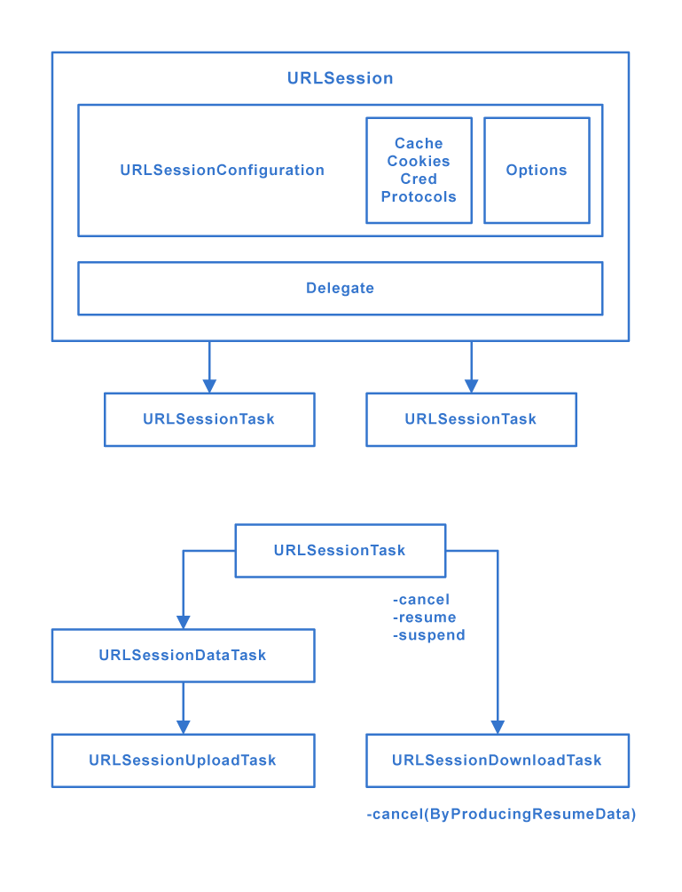

# [URLSession](https://www.raywenderlich.com/3244963-urlsession-tutorial-getting-started)
The **URLSession** class and related classes provide an API for downloading data from and uploading data to endpoints indicated by URLs.

## Overview

**URLSession** is the key object responsible for sending and receiving requests. You create it via **URLSessionConfiguration**, which comes in three flavors:
- **default**: Creates a default configuration object that uses the disk-persisted global cache, credential and cookie storage objects.
- **ephemeral**: Similar to the default configuration, except that you store all of the session-related data in memory. Think of this as a "private" session.
- **background**: Lets the session perform upload or download tasks in the background. Transfers continue even when the app itself is suspended or terminated by the system.

**URLSessionConfiguration** also lets you configure session properties such as timeout values, caching policies and HTTP headers.

There are three types of concrete session tasks:
- **URLSessionDataTask**: Use this task for **GET** requests to retrieve data from servers to memory.
- **URLSessionUploadTask**: Use this task to upload a file from disk to a web service via a **POST** or **PUT** method.
- **URLSessionDownloadTask**: Use this task to download a file from a remote service to a temporary file location.

You can also suspend, resume and cancel tasks. **URLSessionDownloadTask** has the extra ability to pause for future resumption.
